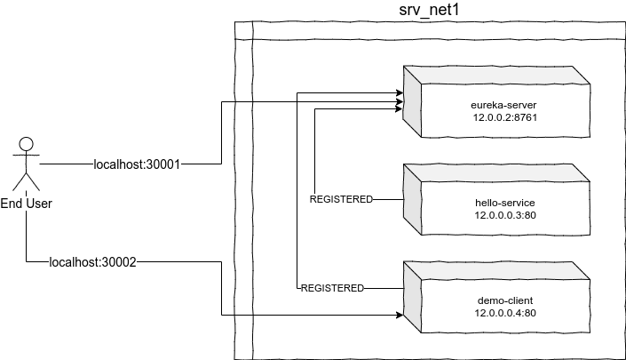

# microservices-simple
Microservices with Spring boot and Netflix OSS 

I have containerized the solution using [docker-compose](./ms-container-demo/docker-compose.yml)



## How to build all maven projects

Switch inside each project directory and run following command:

```
$ mvn clean package -DskipTests
```

## How to Build container images

Please build ALL maven projects first! and then use following command:

```bash
$ cd ms-container-demo
$ docker-compose up -d
$ docker-compose ps
```

The last command should have displayed port mappings to each service. Use following command to get URL for Eureka Server and Client service.

```bash
$ docker-compose port eureka 8761 
$ docker-compose port client 80
```

docker would display port using syntax like this one:

```
0.0.0.0:30001
0.0.0.0:30002
```

you need to replace `0.0.0.0` with `localhost` and then try in browser. for example:

```
localhost:30001
localhost:30002
```

# Script to build and run project (Uses Bash shell script)

```
# Maven build -> container image build -> run using docker-compose
$ ./build-all.sh

# Maven Build only
$ ./build-all.sh mvn

# Only build container images
$ ./build-all.sh image

# Only run docker-compose
$ ./build-all.sh run
```

> The above script would work in `Git Bash` but I have not tested it.

